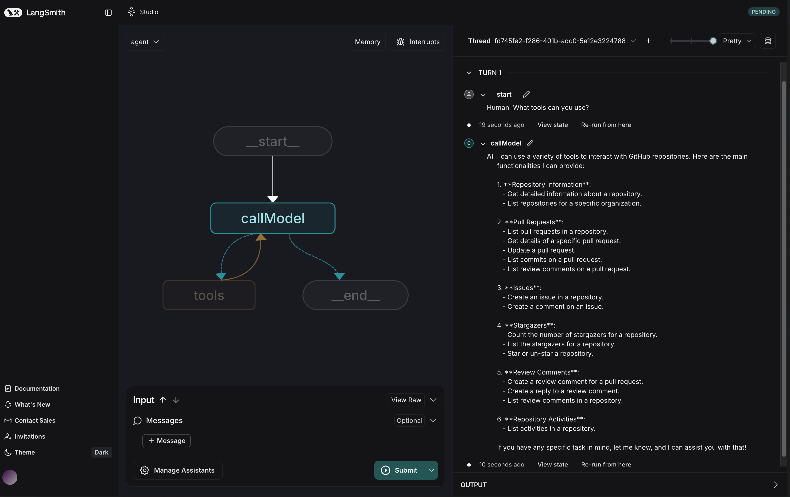

# Arcade LangGraph.js Agent

This project is based on the [LangChain React Agent JS](https://github.com/langchain-ai/react-agent-js/tree/main) repository.



This template showcases a LangGraph.js agent integrated with Arcade tools, designed for LangGraph Studio. The agent uses the ReAct pattern to execute API calls and access various tools through the Arcade API.

## What it does

The Arcade LangGraph agent:

1. Takes a user **query** as input
2. Reasons about the query and decides on an action using Arcade tools
3. Executes the chosen action through the Arcade API
4. Observes the result of the action
5. Repeats steps 2-4 until it can provide a final answer

This approach creates a flexible agent that can interact with multiple services like Google, GitHub, and other external tools through Arcade's unified API.

## Getting Started

1. Clone this repository

2. Create a `.env` file:

   ```bash
   cp .env.example .env
   ```

3. Add your API keys to the `.env` file:

   ```
   OPENAI_API_KEY=your-openai-api-key
   ARCADE_API_KEY=your-arcade-api-key
   ```

4. Install dependencies:

   ```bash
   pnpm install
   ```

5. Run the development server:

   ```bash
   pnpm dev
   ```

## How it works

The core logic is defined in `src/graph.ts`

1. Loads Arcade tools for multiple toolkits (e.g., Google)
2. Creates a model with the tools bound to it
3. Routes messages between tool calls and model reasoning
4. Compiles everything into a graph you can invoke and deploy

## Project Structure

- `src/graph.ts` - Main graph implementation showing how to create and use a LangGraph agent with Arcade tools
- `src/configuration.ts` - Configurable parameters for the agent
- `src/prompts.ts` - Default prompts used by the agent

## Customization

To use different Arcade toolkits or queries:

1. Modify the `toolkit` string in `arcade.tools.list` in `src/graph.ts` to include the desired toolkit (e.g., `["google", "github", "notion"]`)
2. Change the default model in `src/configuration.ts`
3. Update the system prompt in `src/prompts.ts`

Currently supported Arcade toolkits:

- GitHub
- Google
- Notion
- Reddit
- X
- And more

You can check out our [Integrations](https://docs.arcade.dev/integrations) documentation for more information on how to integrate with other tools.

You can also create your own custom tools and integrate them with LangGraph. Check out our [Custom Tools](https://docs.arcade.dev/home/custom-tools) documentation for more information.

## Development

While iterating on your graph, you can edit past state and rerun your app from past states to debug specific nodes. Local changes will be automatically applied via hot reload.

You can create an entirely new thread, clearing previous history, using the `+` button in the top right of the LangGraph Studio interface.

## Authorization Flow

The integration handles authorization requirements for Arcade tools:

- When a tool requires authentication, an authorization URL is generated
- This URL can be presented to the user to complete the authorization process

## Prerequisites

- Node.js (v18+)
- pnpm
- Arcade account with [API key](https://docs.arcade.dev/home/api-keys)
- OpenAI API key or other compatible LLM
